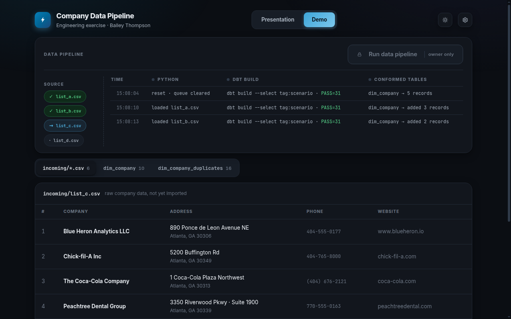
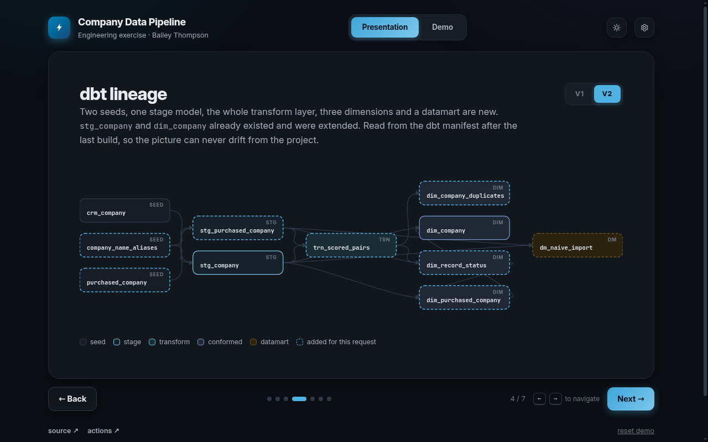
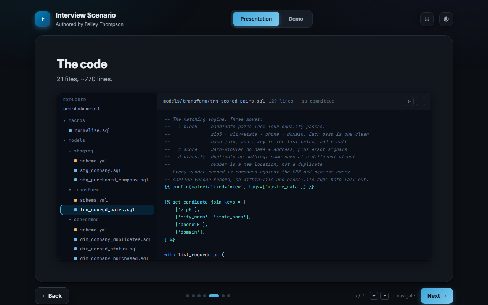

# Import company lists. Create zero duplicates.

The database already has companies in it. Sales bought company lists where one company
arrives as `7-Eleven`, `711`, and `7-Eleven, Inc.`, with the address written three
different ways. This pipeline works out which rows are already there, imports the
ones that are not, and records what happened to every row.

**[Live demo →](https://baybailz.github.io/data-engineering-scenario-crm-dedupe/)** — a presentation
and a working console. The Load button dispatches a GitHub Actions workflow
that runs the real pipeline and publishes the result back to the page.



## The hard part

The CRM has **7-Eleven · 218 Peachtree Street NW**. The lists deliver this:

| Purchased row | Verdict |
|---|---|
| `7-Eleven · 218 Peachtree Street Northwest` | duplicate |
| `711 · 218 Peachtree St NW` | duplicate |
| `7-Eleven, Inc. · 218 Peachtree St` | duplicate |
| `7-11 · 218 Peachtree NW` (no zip) | duplicate |
| `7-Eleven · 1234 Peachtree St SE` | **new** — different street, new location |

Exact-match joins catch none of them. Import everything and one 7-Eleven
becomes five.

## How it matches

1. **Normalize** — strip punctuation and legal suffixes, apply brand aliases
   from a steward-maintained seed, USPS-abbreviate addresses, reduce phone to
   digits and website to domain. Both sides run through the same macros.
2. **Block** — candidate pairs come from four equality passes: zip, city+state,
   phone, domain. Each is one clean hash join; adding a key adds recall.
3. **Score** — Jaro-Winkler on name and address, plus exact signals:
   phone, domain, street number.
4. **Classify** — duplicate or nothing. Identity is name **and** address, so
   the same name at a different street number is a new location.

Master data always wins: an import adds rows, it never edits one.
`dim_company` is incremental on `company_id`, so a repeated run upserts rather
than duplicating.



## Layout

```
incoming/          company CSVs waiting to be loaded
scripts/           run.py (ingest) · export_json.py · scenario.py (page hooks)
seeds/             master data, aliases, generated purchased seed
models/stage/      normalize both sides into match keys
models/transform/  block, score, classify candidate pairs
models/conformed/  dim_company · dim_purchased_company
                   dim_company_duplicates · dim_record_status
models/datamart/   dm_naive_import, the same rows with no matching
tests/             match keys are never blank · candidate pairs are unique
baseline/          the project as it stood before this change, for the V1 view
docs/              the presentation and console, published by Pages
```

Materializations and tags are declared per layer in `dbt_project.yml`; a model
tightens them in its own `config()` where it needs to. Every node is tagged
`scenario`, so one selector runs the whole project.

## Run it

Locally, free, about two minutes:

```bash
python3 -m venv .venv && .venv/bin/pip install -r requirements.txt
export DBT_PROFILES_DIR=.
.venv/bin/python scripts/run.py                      # stage the next file
.venv/bin/dbt build --select tag:scenario            # models + tests
```

Repeat to load the remaining files one at a time; `--action reset` starts over.
Those are the same commands the GitHub Actions workflow runs. Every pull request
runs the same build plus `sqlfluff`; nothing merges red.

## Deliverables

| Model | What it answers |
|---|---|
| `dim_company_duplicates` | one row per suspect **pair**: what it matched and the scores behind it |
| `dim_record_status` | one row per purchased **record**: `new`, or which kind of duplicate |
| `dim_purchased_company` | the clean insert set, mapped to the CRM schema |
| `dim_company` | the company dimension: master plus imported rows |



## How this was built

I used a coding agent to write the code. The diff is the interesting part.

The first commit is the unsupervised version: one prompt, one pass, no review.
It runs. It also reads like every dbt tutorial on the internet.

Everything after it was directed. I read the models, pushed back on the design,
and sent it back until the system matched how I would have built it by hand.

| Unsupervised | Directed |
|---|---|
| `models/intermediate/` and `models/marts/` | `stage/` → `transform/` → `conformed/`, prefixes to match |
| `from list_recs a join crm b` | `inner join crm_companies as crm_company` |
| seed types guessed by dbt | pinned in `seeds/schema.yml`, a `schema.yml` per folder |
| a rebuilt table plus a `MERGE` script nothing ran | `dim_company` incremental on `company_id`, a real MERGE |
| alias seed holds `711,7 eleven` | alias seed holds `7-11,7-Eleven`, normalized at join |
| one `OR` join and a `needs_review` status | declarative blocking keys, identity is name and address |
| generic tests only | a test that fails the build when a match key is blank |

```bash
git diff df690a5..main
```

Review caught a live defect, not just style. DuckDB's `regexp_replace` replaces
only the first match without the `g` flag, so every phone number was being
truncated and the phone blocking key was quietly dead.

Anyone can prompt an agent into a working pipeline. The question is whether it
survives contact with a team.

This one is built to production standards. Adding a blocking key is one line in a
list. Adding a source is one stage model. Changing how a match is scored happens in
one file, and the tests fail loudly if it breaks something downstream. A steward
maintains the alias list in a spreadsheet, not in SQL.

That is the part the prompt does not give you.

## What I would add next

- Transitive clustering (connected components or Splink) so A≈B≈C resolves once.
- CASS-certified address standardization instead of regex USPS abbreviations.
- Thresholds tuned against a labelled sample rather than hand-picked cutoffs.
- Snowpipe or Airflow on file arrival. Same models.
