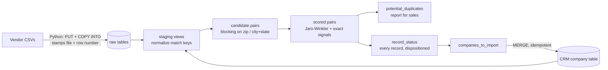

# CRM Company List Dedupe ETL

An ETL pipeline that imports two purchased company lists into a CRM without
creating duplicates. Built with **dbt + SQL** (Snowflake as the target
warehouse, DuckDB for a zero-cost local demo) and **Python** for file ingest.

The scenario: the CRM has a `company` table. Sales bought two vendor CSV lists.
We must (1) report potential duplicates between the files and against the CRM,
(2) import only non-duplicated records, and (3) produce a status for every
record in both files.

## The hard part, in one example

All five of these refer to the same CRM company (or don't):

| Input | Verdict |
|---|---|
| `7-Eleven, 218 Peachtree Street Northwest, Atlanta, GA 30303` | duplicate (address spelling) |
| `711, 218 Peachtree St NW, Atlanta, GA 30303` | duplicate (brand alias) |
| `7-Eleven, Inc., 218 Peachtree St, Atlanta, GA 30303` | duplicate (legal suffix, partial address) |
| `7-11, 218 Peachtree NW, Atlanta, GA` | duplicate (alias, missing zip) |
| `7-Eleven, 1234 Peachtree St SE, Atlanta, GA 30303` | **needs review** — same name, different street |

Exact-match joins catch none of these correctly. The pipeline does, including
routing the last one to a human instead of guessing.

## Architecture



Everything from staging onward is dbt (`models/`), so the matching logic is
version-controlled, tested (`dbt test`), and documented SQL rather than logic
buried in an ETL GUI.

## Duplicate-matching methodology

**1. Normalize** ([macros/normalize.sql](macros/normalize.sql)) — build match
keys on both sides:
- Company name: lowercase, strip punctuation, drop leading "The" and trailing
  legal suffixes (`Inc`, `LLC`, `Co`, ...), then apply a maintained alias seed
  (`711` → `7 eleven`). Data fixes become a CSV row, not a code change.
- Address: standardize USPS suffixes and directionals (`Street`→`St`,
  `Northwest`→`NW`), concatenate address lines, extract the street number.
- Phone → last 10 digits. Website → root domain. Zip → 5 digits.

**2. Block** — only compare pairs sharing `zip5` OR `city+state`
([int_scored_pairs](models/intermediate/int_scored_pairs.sql)). Fuzzy-scoring
every record against every record is O(N×M); blocking keeps it tractable at
real list sizes. Each list record is compared to the CRM table and to every
earlier list record, covering CRM, cross-file, and within-file duplicates in
one pass.

**3. Score** — Jaro-Winkler similarity on normalized name and address
(built into both Snowflake and DuckDB; no UDFs needed), plus exact signals:
phone match, domain match, and street-number match.

**4. Classify** — tiered rules:
- `duplicate`: name ≥ 0.85 similar, same geography, same street number,
  similar street text; or a hard identifier (phone/domain) backing a good
  name match.
- `review`: name ≥ 0.92 similar in the same city but the street number
  differs. Could be a second location or a typo; a human decides. This is
  what keeps `7-Eleven @ 1234 Peachtree` from being silently merged into
  `7-Eleven @ 218 Peachtree`.
- otherwise `new`.

**5. Survivorship + idempotent load** — within file-only duplicate clusters
the earliest record survives and is imported; the CRM keeps its version when
it already has the company. The final load is a `MERGE` keyed on the source
record ([scripts/merge_into_company.sql](scripts/merge_into_company.sql)), so
re-running the pipeline never double-inserts.

## Deliverables (actual demo output)

`record_status` — every record from both files, dispositioned:

```text
record_key  company_name           status                 matched
list_a-001  7-Eleven (1234 Pchtr)  needs_review           CRM 1: 7-Eleven
list_a-002  7-Eleven               duplicate_of_crm       CRM 1: 7-Eleven
list_a-003  7-Eleven, Inc.         duplicate_of_crm       CRM 1: 7-Eleven
list_a-004  711                    duplicate_of_crm       CRM 1: 7-Eleven
list_a-005  Blue Heron Analytics   new
list_a-006  Piedmont Coffee Co     new
list_a-007  The Home Depot         duplicate_of_crm       CRM 2: Home Depot
list_b-001  7-11                   duplicate_of_crm       CRM 1: 7-Eleven
list_b-002  Delta Airlines         duplicate_of_crm       CRM 3: Delta Air Lines
list_b-003  Home Depot #123        duplicate_of_crm       CRM 2: Home Depot
list_b-004  Piedmont Coffee        duplicate_cross_file   list_a-006
list_b-005  Rockdale Paper Supply  new
list_b-006  Sunrise Bakery         new
list_b-007  Sunrise Bakery LLC     duplicate_within_file  list_b-006
```

`potential_duplicates` — the pair-level report for the sales team, with
similarity scores and what each record matched.

`companies_to_import` — the four surviving `new` records, mapped from the
vendor-list schema (3 address lines) to the CRM schema, with new company IDs.

## Run it locally (free, ~2 minutes)

```bash
python3 -m venv .venv && .venv/bin/pip install -r requirements.txt
.venv/bin/dbt build          # seeds + models + 11 data tests against DuckDB
.venv/bin/python -c "import duckdb; print(duckdb.connect('crm_dedupe.duckdb').sql('select * from record_status'))"
```

## Run it on Snowflake

Works on a [free 30-day trial account](https://signup.snowflake.com/) (no
perpetual free tier exists; an XS warehouse on trial credits covers this many
times over). Same models, zero SQL changes — the `similarity` macro adapts to
Snowflake's `JAROWINKLER_SIMILARITY`:

```bash
pip install dbt-snowflake snowflake-connector-python
export SNOWFLAKE_ACCOUNT=... SNOWFLAKE_USER=... SNOWFLAKE_PASSWORD=...
python scripts/load_to_snowflake.py seeds/list_a.csv seeds/list_b.csv
dbt build --target snowflake
```

## Production hardening (what I'd add next)

- **Address quality**: a CASS-certified standardizer or libpostal instead of
  regex-based USPS abbreviation handling; geocoding for a lat/long signal.
- **Transitive clustering**: connected-components clustering of match pairs
  (or [Splink](https://github.com/moj-analytical-services/splink) /
  `recordlinkage` in Python) so A~B~C resolves as one cluster even when A and
  C don't directly match.
- **Threshold tuning**: label a sample of pairs, then tune score cutoffs
  against precision/recall instead of hand-picked constants.
- **Review workflow**: land `needs_review` pairs in a small approve/reject UI
  or sheet; approved decisions feed the alias seed so the pipeline learns.
- **Orchestration**: Snowpipe or an Airflow/dagster job on file arrival;
  dbt tests gate the MERGE so a bad vendor file can't pollute the CRM.
- **Auditability**: every imported row already carries `source_record_key`
  (file + line), so any CRM record traces back to the exact vendor-file line.
